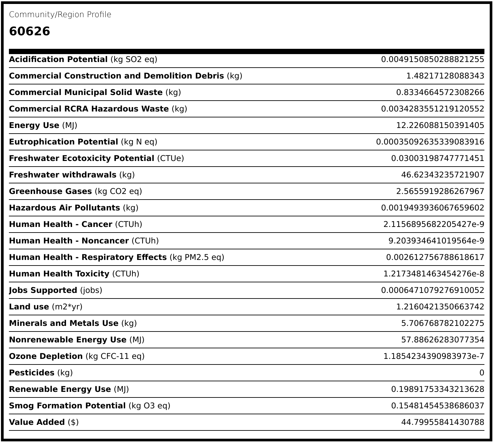

# Featured School: Loyola University Chicago, Lake Shore Campus

An important dimension of the mission [Loyola University Chicago](https://www.luc.edu)'s [School of Environmental Sustainability](https://www.luc.edu/sustainability) is to advance our knowledge of environmental problems and developing solutions through original research and community outreach.

In particular, SES strives to advance sustainability in operations across all university campuses and to develop an environmentally conscious culture throughout the university.

Initially, this section will highlight three sustainability initiatives at the Lake Shore Campus on the far north side of Chicago, Cook County, Illinois, which we believe to have high potential for replication at other urban colleges and universities.

## Community Environmental Profile for US Zip Code 60626

